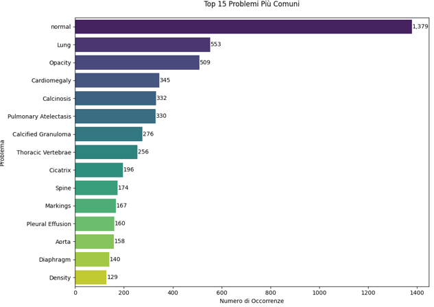
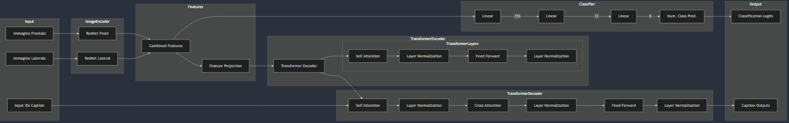

# Medical Report Generation using Deep Learning

## Project Overview
This project aims to automate the generation of medical reports from chest X-ray images using advanced Deep Learning techniques. By combining Computer Vision (CV) for image analysis and Natural Language Processing (NLP) for text generation, the system can identify medical conditions and describe them in natural language.

The project explores multiple architectures, ranging from binary classification to complex Transformer-based report generation.

## Models Implemented

The repository contains three distinct approaches to the problem, each implemented in a separate Jupyter Notebook:

### 1. Binary Classification & Captioning
- **Notebook**: `binarymalatonon-gpt2.ipynb`
- **Objective**: Classify X-rays as "Sick" or "Not Sick" and generate a corresponding medical report.
- **Architecture**:
    - **Image Encoder**: Dual ResNet-50 models (Frontal & Lateral views).
    - **Classifier**: MLP for binary prediction.
    - **Decoder**: GPT-2 model with cross-attention for caption generation.
- **Key Features**:
    - Uses `FocalLoss` for class imbalance.
    - Custom `MedicalCaptionLoss` to prioritize medical terminology.

### 2. Multiclass Zone Classification & Captioning
- **Notebook**: `multiclasszonecategory-gpt2.ipynb`
- **Objective**: Classify pathologies into 4 macro-categories and generate reports.
    1. No Problem
    2. Pulmonary System
    3. Cardiovascular System
    4. Musculoskeletal System
- **Architecture**: Similar to the binary model but adapted for 4-class output.
- **Key Features**:
    - Handles multi-zone classification.
    - Filters complex cases with multiple overlapping macro-categories.

### 3. Transformer with Nucleus Sampling
- **Notebook**: `transformer-ksampling-nucleus.ipynb`
- **Objective**: High-quality report generation using a full Transformer architecture.
- **Architecture**:
    - **Encoder**: ResNet-50 for feature extraction.
    - **Text Generation**: Transformer Encoder-Decoder architecture.
- **Key Features**:
    - Implements **Nucleus Sampling** and **K-Sampling** for more diverse and natural text generation.
    - Advanced attention mechanisms for better image-text alignment.

## Project Visuals

Below are visual resources extracted from the project presentation, illustrating the architecture, data distribution, and results.

| | |
|:---:|:---:|
|  |  |
|  |  |
|  | |

*(Note: `image2.svg` is available in the images folder but not displayed here)*

## How to Run on Kaggle

This project is optimized for the Kaggle environment. Follow these steps to set it up:

### 1. Prerequisites
- A Kaggle account.
- Access to the **Indiana University Chest X-rays** dataset.

### 2. Setup
1. Upload the desired notebook (`.ipynb` file) to Kaggle.
2. Add the dataset:
    - Go to **File -> Add Data**.
    - Search for `chest-xrays-indiana-university` and add it.
    - Ensure the path `/kaggle/input/chest-xrays-indiana-university/` matches the notebook's data loader.

### 3. Execution
- Enable **GPU Accelerator** in the notebook settings for faster training (T4 x2 is recommended).
- Run all cells in order. The notebook will:
    - Install necessary libraries (transformers, etc.).
    - Preprocess the data.
    - Train the model (or load saved weights if configured).
    - Generate reports on the test set.

### 4. Dependencies
The notebooks primarily rely on:
- `torch`
- `torchvision`
- `transformers` (Hugging Face)
- `PIL`
- `pandas` & `numpy`

## Directory Structure
```
├── binarymalatonon-gpt2.ipynb        # Binary classification model
├── multiclasszonecategory-gpt2.ipynb # Multiclass model
├── transformer-ksampling-nucleus.ipynb # Transformer model
├── presentation_deep_learning.pptx   # Project presentation
├── report_deep_learning.pdf          # Detailed project report
├── README.md                         # This file
├── images/                           # Extracted project images
└── scripts/                          # Utility scripts (e.g., image extraction)
```